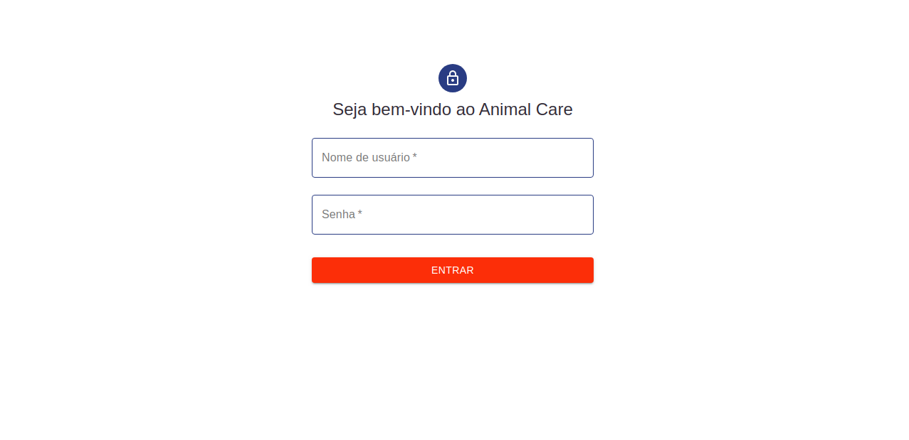
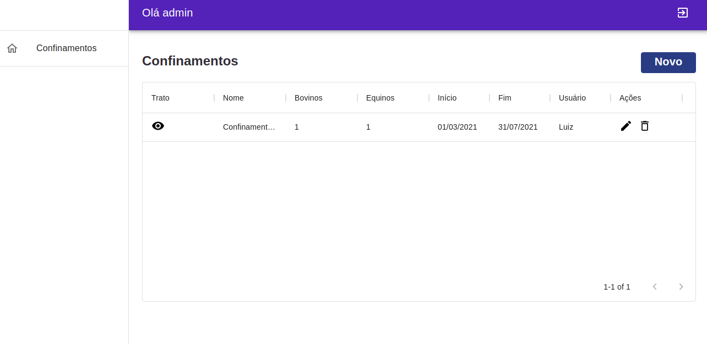
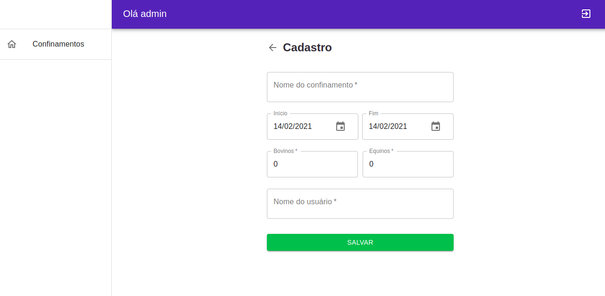
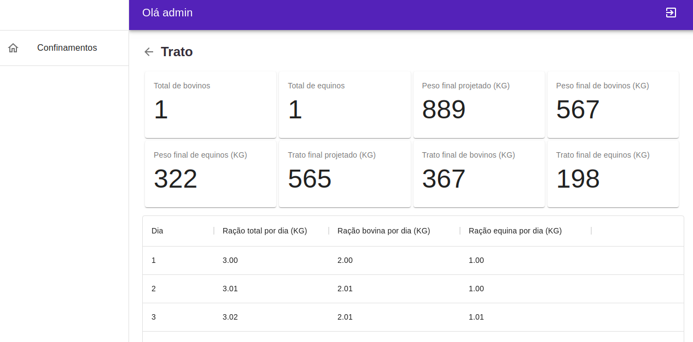
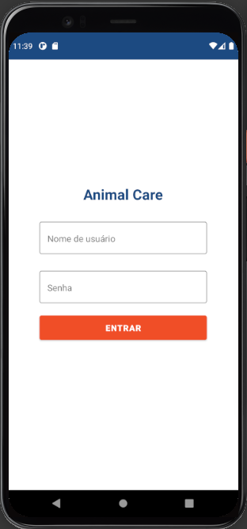
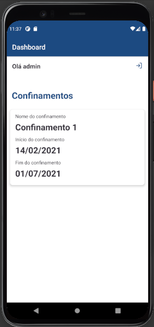
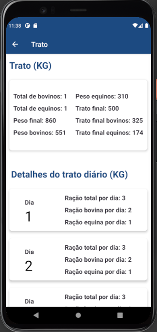

# Introdução

Animal Care - Aplicação cadastro de confinamentos de animais e projeção de trato.

# Pré-requisitos

- Ter o node instalado na máquina.
- Android Studio com Android SDK instalado na máquina para rodar o app mobile.

# Sobre o build

Esta Aplicação foi criada com a utilização das seguintes ferramentas:

Backend:

- Node
- Typescript

Frontend:

- React
- Material-UI

Mobile:

- React Native

# Execução

 Para executar o backend da aplicação siga os seguintes passos:
 
 - Clone este repositório e entre na pasta /server;
 - Rode o comando yarn ou npm install para instalar as dependências;
 - Rode o comando yarn dev:server ou npm run dev:server e o backend estará rodando na porta 3333.
 
 Para executar o app web, siga os seguintes passos:
 
 - Clone este repositório e entre na pasta /web;
 - Rode o comando yarn ou npm install para instalar as dependências;
 - Rode o comando yarn start ou npm run start e o a-- estará acessível no endereço http://localhost:3333.
 
 Para executar o app mobile, siga os seguintes passos:
 
 - Clone este repositório e entre na pasta /mobile;
 - Rode o comando yarn ou npm install para instalar as dependências;
 - Caso esteja rodando o app diretamente em um dispositivo físico, altere o arquivo api.js de dentro da pasta services para o IP da sua máquina.
 - Rode o comando yarn start ou npm run start no diretório do app.
 - Em outro terminal, no mesmo diretório, rode o comando npx react-native run-android e o app será instalado no seu emulador/dispositivo.
 
 
# Screenshots

